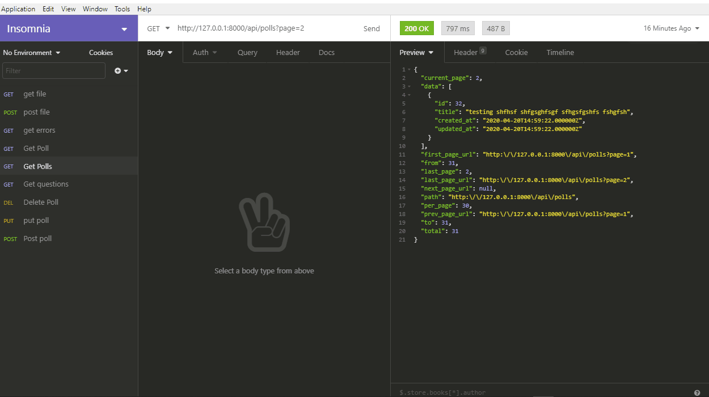

##Setup / Installation

1. Download and install git

2. Clone project

```bash
    > git clone https://github.com/ereyomi/laraPoll.git
```

3. cd project-name

4. Install Dependencies

```bash
    > npm install (optional)
    > composer require
```
5. Copy the .env.example file and rename it into the .env file (For this you can run the following command)

```bash
	> copy .env.example .env
```
6. Run the following command to generate a new key

```bash
	> php artisan key:generate
```
7. Set Up DataBase (sqlite)

- Remove DB_DATABASE=... from .env and use the path in the config/database.php
- set 'default' => env('DB_CONNECTION', 'sqlite'),

	make sure this exist
	
	'connections' => [

        'sqlite' => [
            'driver' => 'sqlite',
            'url' => env('DATABASE_URL'),
            'database' => env('DB_DATABASE', database_path('database.sqlite')),
            'prefix' => '',
            'foreign_key_constraints' => env('DB_FOREIGN_KEYS', true),
        ],
		...
		
- move your database.sqlite to 'database' folder in your app root folder.

if you want to use DB_DATABASE

In the .env file use absolute  path 
e.g
DB_DATABASE=C:\xampp\htdocs\larapoll\database\database.sqlite


8. Migrate DataBase

```bash
	> php artisan migrate
	> php artisan db:seed (start up with dummy data)
	> php artisan migrate:fresh --seed (this is the combination of the above commands)
```
9. Run project

```bash
    > php artisan serve 
```
10. if you run into any problem concerning connecting to database, run the following commands

```bash
	> php artisan config:cache
	> php artisan config:clear
	> restart server: php artisan server
```
11. Set the right permissions on all directories and files in your project by simply running (Optional)

```bash
	> chmod 755 -R nameofyourproject/
	> chmod -R o+w nameofyourproject/storage
```

## License

The Laravel framework is open-sourced software licensed under the [MIT license](https://opensource.org/licenses/MIT).
